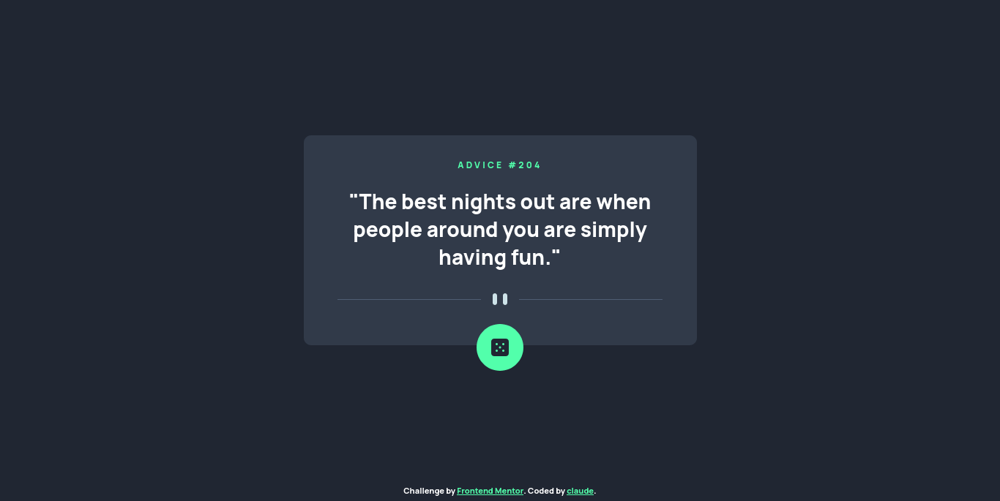
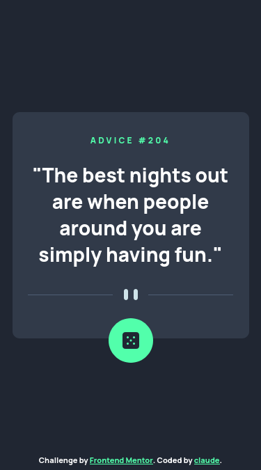

# Frontend Mentor - Advice generator app solution

This is a solution to the [Advice generator app challenge on Frontend Mentor](https://www.frontendmentor.io/challenges/advice-generator-app-QdUG-13db). Frontend Mentor challenges help you improve your coding skills by building realistic projects.

## Table of contents

- [Overview](#overview)
  - [The challenge](#the-challenge)
  - [Screenshot](#screenshot)
  - [Links](#links)
- [My process](#my-process)
  - [Built with](#built-with)
  - [What I learned](#what-i-learned)
  - [Continued development](#continued-development)
  - [Useful resources](#useful-resources)
- [Author](#author)

## Overview

### The challenge

Users should be able to:

- View the optimal layout for the app depending on their device's screen size
- See hover states for all interactive elements on the page
- Generate a new piece of advice by clicking the dice icon

### Screenshot

<h2 align="center" >Desktop</h2>

 

 
 
<h2 align="center">Mobile</h2>

 

### Links

- Solution URL: [Add solution URL here](https://your-solution-url.com)
- Live Site URL: [Add live site URL here](https://your-live-site-url.com)

## My process

### Built with

- Flexbox
- Mobile-first workflow
- [Next.js](https://nextjs.org/) - React framework
- [SASS](https://sass-lang.com/) - For styles
- [Typescript](https://www.typescriptlang.org/) - for typings on JS?

### What I learned

I really had a hardtime on using typescript on React/Next. Though I found some interesting things online wich help me.

### Continued development

- Adding the functionalities provide by [Advice Slip API](https://api.adviceslip.com/)

### Useful resources

- [Using Refs in React](https://dev.to/carlosrafael22/using-refs-in-react-functional-components-part-1-useref-callback-ref-2j5i) - This helped me for providing or adding types on useRef.

## Author

- Frontend Mentor - [@claude1018](https://www.frontendmentor.io/profile/claude1018)
